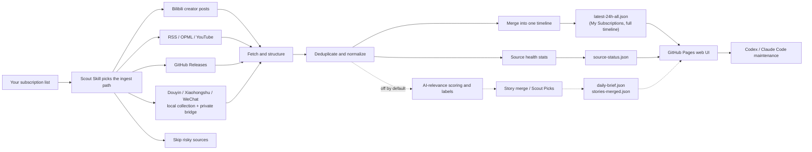

<div align="center">

# AI News Radar

## Personal Subscription Aggregator｜One timeline for everyone you follow

**Bilibili, Douyin, Xiaohongshu, WeChat public accounts, YouTube, RSS, GitHub Releases — whatever the people you follow just posted, all on one page, in one timeline.**

[](https://github.com/kunkunzi996/ai-news-radar/stargazers)
[](https://kunkunzi996.github.io/ai-news-radar/)
[](https://github.com/kunkunzi996/ai-news-radar/actions/workflows/update-news.yml)
[](skills/radar/README.md)
[](LICENSE)

[Live site](https://kunkunzi996.github.io/ai-news-radar/) · [中文](README.md) · [Radar Skill](skills/radar/README.md) · [Scout Skill](skills/ai-news-radar/README.md) · [Source strategy](docs/SOURCE_COVERAGE.md)

</div>

---

## Pick your lane in 30 seconds

**① Just want to read your subscription feed** → no install needed, open the [live site](https://kunkunzi996.github.io/ai-news-radar/).

**② Want your agent to read it for you** → install the Radar Skill (ai-radar). Zero API, zero key, zero server:

```bash
npx skills add LearnPrompt/ai-news-radar -s ai-radar -g
```

Then just ask your agent: `What happened in AI today?`


**③ Want one that is fully yours** → fork this repo and let the in-repo [Scout Skill](skills/ai-news-radar/README.md) classify your sources and deploy GitHub Pages. Your sources, your data.

The three lanes are one road: read the feed → let your agent read it → run your own.

---

## What is this?

AI News Radar is an **auto-updating personal subscription aggregator**.

The people you follow — Bilibili creators, Douyin and Xiaohongshu creators, WeChat public accounts, YouTube channels, RSS blogs, GitHub projects — post something new, and this thing fetches it every hour, deduplicates it, and merges it into a single static page as one timeline.

> **About the "AI" in the name**: this project started as a "24h AI Updates Radar" that used AI-relevance scoring to pick AI news out of a large source pool. **Since 2026-07-11 it is a personal subscription aggregator: AI relevance is no longer a filter.** Whatever the people you subscribe to post shows up, AI-related or not.
>
> The AI scoring engine (`scripts/ai_relevance.py`) is **kept but off by default**: the threshold is read from `AI_RELEVANCE_THRESHOLD` (default `0.65`), and this deployment sets the GitHub Actions variable to `0`, i.e. no filtering. Delete that variable to get the "AI picks" mode back — every capability is still there.

No install required: open the page and read your feed. Want one that is entirely yours? Fork the repo, plug in your own sources, and the data is yours. Agents like Codex / Claude Code can use the in-repo **Scout Skill** to evaluate and onboard new sources, maintain fetch logic, and deploy GitHub Pages.

It is not "one more news page" — it is a lightweight pipeline: **source evaluation → fetch → dedupe → timeline merge → source health → static publishing**, and it burns no model tokens once deployed.


## Why build this?

The people you follow are scattered across seven or eight apps.

A few creators on Bilibili. A few on Douyin. A pile of unread WeChat public accounts. A few YouTube channels. Plus some RSS blogs and GitHub projects.

To find out "what did the people I follow post today", you have to open each app and pull-to-refresh — and every one of them wants another ten minutes of your attention.

**This project collects them into one chronological stream.** You see who you subscribed to, and only them. Whether a post is about AI is irrelevant.

It does not decide what is worth reading for you, and it does not recommend things you never subscribed to — **you pick the sources, time decides the order**.

The companion **Scout Skill** does a different job: it helps you evaluate and onboard new sources (which ones expose a stable RSS feed, which need a bridge, which are not worth adding), and maintains fetch logic and deployment. It is a tool for people running their own instance — it takes no part in filtering content.

## What it can do

### For readers

- Open the live site and read "My Subscriptions" — what the people you follow just posted
- Switch by platform: Douyin / Xiaohongshu / WeChat / Bilibili / YouTube / GitHub
- Locate items quickly with site, keyword, time, and source filters
- See each item's source platform, author, and publish time; mark what you've read
- Use source health to see which sources are updating normally and which broke
- With AI filtering on (`AI_RELEVANCE_THRESHOLD` ≠ 0), you also get Scout Picks, AI labels, and relevance scores — off by default in this deployment

### For content creators

- Preserve original source links for deeper research, fact checking, and topic planning
- Merge multiple sources for the same event, reducing duplicate reading
- With AI filtering on, use AI labels and multi-source overlap to judge topic credibility and priority (off by default)

### For developers and agents

- Requires no API key, login state, or LLM quota by default
- Source types: Bilibili creators, Douyin/Xiaohongshu creators, WeChat public accounts, YouTube channels, RSS/OPML, GitHub Releases
- GitHub Actions automatically generates `data/*.json` and publishes to GitHub Pages
- Codex / Claude Code / Hermes / OpenClaw can use the in-repo Scout Skill to maintain sources, fetch logic, and the web page
- Platforms that need a login (Douyin, Xiaohongshu, WeChat) go through local collection + a private bridge repo — **cookies and login state never leave your machine**

## How the positioning evolved

This project started as a "24h AI Updates Radar": it **picked AI news out of a large source pool** using AI-relevance scoring, story merging, hot clustering, and a quality-over-quantity picks gate.

In practice, the thing worth opening every day was not "what happened in AI today", but **"what did the people I follow post today"** — and that was scattered across seven or eight apps, with no single page to read it all.

**Since 2026-07 the main line is a personal subscription aggregator**: the default layer is one unified timeline of your own sources, and AI relevance is no longer a filter.

All the original AI capabilities are **kept, just off by default**:

- **AI-relevance scoring** (`scripts/ai_relevance.py`): threshold from `AI_RELEVANCE_THRESHOLD` (default `0.65`). This deployment sets the Actions variable to `0`, i.e. no filtering. **Delete the variable to return to "AI picks" mode.**
- **Story merging / multi-source evidence**: merges multiple sources for one event (`stories-merged.json`, `merge-log.json`); harmless to leave on.
- **Scout Picks and the hot view**: ranks clusters by multi-source mass × time decay — something is only "hot" when several independent sources say it. Hides itself when there is not enough heat, rather than showing an empty shell.
- **Scoring backtest tool** (`scripts/backtest_scoring.py`): replays two versions of the scoring logic against the archive. House rule unchanged — scoring changes ship with a ≥14-day replay report.
- **ai-radar consumer skill**: install it, ask your agent "What happened in AI today?", and it reads this site's public JSON directly. Zero API, zero key.

See [Releases](https://github.com/LearnPrompt/ai-news-radar/releases) for the full history.

## How it works



Solid lines are the default path: fetch → dedupe → timeline → static page. The dashed branch is the optional AI-picks path, enabled by setting `AI_RELEVANCE_THRESHOLD` to a non-zero value.

Dumping thousands of items onto a page is useless, so the handling is a stable pipeline: fetch, deduplicate, normalize, track source health, generate a static site. No model tokens are spent once deployed.

The public version needs no LLM API key, no X API, no email access. Platforms that require a login (Douyin, Xiaohongshu, WeChat) go through "local collection → private bridge repo → read-only clone in Actions", so **cookies and login state never enter a public repo**.

## Data outputs

Each update generates a set of static JSON files. The page only reads these files and does not need a backend service.

Core files include:

- `data/latest-24h-all.json`: **the subscription feed** (read by "My Subscriptions" and every platform tab). This deployment runs `--all-time`, so it is the full archive timeline, not just 24 hours
- `data/archive.json`: the full archive; retention is controlled by the `ARCHIVE_DAYS` Actions variable (default 180 days)
- `data/source-status.json`: per-source fetch status, item counts, and source health
- `data/latest-24h.json`: updates after AI-relevance filtering (equals the full set when `AI_RELEVANCE_THRESHOLD=0`)
- `data/daily-brief.json`: Scout Picks story timeline, used for the homepage top slots in AI-picks mode
- `data/stories-merged.json` / `data/merge-log.json`: merged story set and merge records, for debugging and auditing

The last three belong to the AI-picks path; in the default (unfiltered) mode the page mainly reads the first three.

## Quick start

Readers do not need to install anything. Open the live site directly.

To fork and customize your own version locally:

```bash
git clone https://github.com/kunkunzi996/ai-news-radar.git
cd ai-news-radar
python3 -m venv .venv
source .venv/bin/activate
pip install -r requirements.txt
python scripts/update_news.py --output-dir data --window-hours 24
python -m http.server 8080
```

Open:

```text
http://localhost:8080
```

If you have your own OPML:

```bash
cp feeds/follow.example.opml feeds/follow.opml
# Put your own subscriptions into feeds/follow.opml. Do not commit this file.
python scripts/update_news.py --output-dir data --window-hours 24 --rss-opml feeds/follow.opml
```

## Tutorial for agents

If you want Codex / Claude Code / OpenClaw / Hermes to help you build your own version, say:

```text
Use Scout Skill for AI News Radar. Ask me for my subscription list first (Bilibili / Douyin / Xiaohongshu / WeChat / YouTube / RSS / GitHub), then decide whether each source should use an official RSS feed, a public feed, a local-collection bridge, or be skipped. The goal is to deploy a serverless personal subscription aggregator that updates automatically with GitHub Actions and merges everything the people I follow post into one timeline. Do not commit any API keys, cookies, tokens, or login state into the repo.
```

The repo ships two skills — the radar reads, the scout selects:

- `skills/radar/`: **ai-radar** (consumer side) — install without forking, ask AI news questions in natural language, get a brief from this site's public JSON
- `skills/ai-news-radar/`: **Scout Skill** (maintainer side) — after forking, use it to classify sources, maintain fetch logic, and deploy GitHub Pages

When a new agent takes over validation, read these first:

- `README.md`
- `README.en.md`
- `docs/GPT_HANDOFF.md`
- `docs/SOURCE_COVERAGE.md`
- `docs/V2_PRODUCT_BRIEF.md`

## GitHub Actions updates

`.github/workflows/update-news.yml` is already configured.

- Runs on a staggered schedule: `7,37 * * * *` (minute 7 and 37 of every hour, avoiding the top-of-hour rush)
- Also refreshes immediately on pushes to `master`, except for pure `data/**` changes; `workflow_dispatch` works too
- Automatically generates and commits `data/*.json`
- Reads the public online config `config/online-sources.json`; RSS/YouTube feeds in it are managed through `feeds/online-sources.opml`
- Five source types are supported online: Bilibili creators, Douyin/Xiaohongshu creators, WeChat public accounts, GitHub Releases, RSS/YouTube feeds
- Douyin, Xiaohongshu, and WeChat need a login, so they run as "local scheduled collection → export public-fields-only JSONL → push to a private bridge repo → Actions clones it with a read-only deploy key". Cookies and login state never enter a public repo
- Archive retention is controlled by the `ARCHIVE_DAYS` variable (default 180); AI filtering by `AI_RELEVANCE_THRESHOLD` (`0` in this deployment = no filtering)
- AgentMail, X API, SocialData, TikHub, and WaytoAGI are no longer part of the default deployment output. To restore the old all-sources mode, run `python scripts/update_news.py --source-scope all_sources ...` locally

### Safe GitHub starred-repository sync (V3)

The local console also includes a GitHub starred-repository sync flow. It reads public stars only;
there is no Preview token, TTL, cursor, or GitHub login state. The binding stores a numeric
`account_id`, and managed repositories store numeric `repo_id` values. Every run starts with
Preview and requires an explicit confirmation before Apply.

- One GitHub account is supported, with at most 50 public stars; the 51st public star aborts the entire run.
- Private repositories contribute only to a skipped count; their names, URLs, and ids are never shown.
- Releases are preferred. Only when a repository has no Release does the fetcher read public commits, keeping at most one newest commit snapshot per stable repository identity per UTC day.
- Unstarring only disables the managed source. It does not delete the source or trigger pending purge; history ages out under `archive_days`.
- The UI reports `no_change`, `pushed`, `saved_not_committed`, and `committed_not_pushed`, plus partial/deferred, stale, and Recovery states.
- Apply pushes only an exact operation commit proven by its manifest, operation trailer, stable patch-id, and file hashes; it never uses a bare `git push` or whole-worktree restore.

The V3 code is complete and has passed automated and mock-browser checks. A real account Preview/Apply
is still pending, so this feature must not be described as live before that acceptance.

By default, the core pipeline requires no API keys.

Advanced source templates live in `examples/advanced-sources.env.example`.

Budget notes are in `docs/research/advanced-source-free-tier-budget-2026-05-10.md`.

The X API demo config is in `docs/guides/x-api-demo-config.md`.

The single-account / single-newsletter demo is in `docs/guides/rileybrown-alphasignal-demo.md`.

## License

[MIT](LICENSE)
