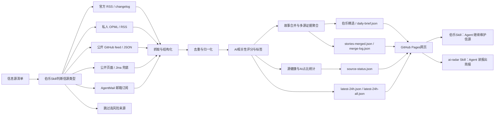

<div align="center">

# AI News Radar

## 24小时AI更新雷达｜伯乐Skill

**伯乐Skill（Scout Skill）帮你从一堆信源里选出千里马，并把分散消息合并成可追踪的AI故事线。**

[](https://github.com/LearnPrompt/ai-news-radar/stargazers)
[](https://learnprompt.github.io/ai-news-radar/)
[](https://github.com/LearnPrompt/ai-news-radar/actions/workflows/update-news.yml)
[](skills/radar/README.md)
[](LICENSE)

[在线页面](https://learnprompt.github.io/ai-news-radar/) · [English](README.en.md) · [雷达Skill](skills/radar/README.md) · [伯乐Skill](skills/ai-news-radar/README.md) · [信息源策略](docs/SOURCE_COVERAGE.md)

</div>

---

## 30秒选边上车

**① 只想看AI日报** → 不用装任何东西，直接打开[在线页面](https://learnprompt.github.io/ai-news-radar/)。

**② 想让Agent替你读** → 装雷达Skill（ai-radar），零API、零Key、零服务器：

```bash
npx skills add LearnPrompt/ai-news-radar -s ai-radar -g
```

装完对Agent说一句：`今天AI圈有什么？`


**③ 想要一个完全属于自己的雷达** → fork本仓库，让内置的[伯乐Skill](skills/ai-news-radar/README.md)帮你录入信源、部署GitHub Pages。信源你选，数据归你。

三层是一条路：看报 → 让Agent读报 → 自己办报。

---

## 这是什么

AI News Radar是一个自动更新的24小时AI更新雷达。它不只是把AI新闻抓回来，会先判断信息源质量，把同一个事件合并成故事线，最后用伯乐Skill精选、AI标签、源健康和AI占比帮你判断，

什么信息值得看，什么值得深挖，什么只是噪音。

普通用户直接打开网页，看最近24小时AI、模型、开发者工具和技术生态更新。开发者可以fork这个仓库，接入自己的OPML/RSS、公开feed、静态页面或AgentMail邮箱。Codex / Claude Code这类 Agent 可以使用项目内置的 **伯乐Skill**，继续帮你判断新的信息源、维护抓取逻辑、部署 GitHub Pages。

这个项目永远都不会是“又一个新闻网页”。

它的核心逻辑是**伯乐Skill**，帮你从一堆信源里选出千里马。哪些源值得长期追踪，哪些源适合做成RSS/OPML，哪些源只能接付费的API，哪些源看起来更新很多但实际上跟你长期关注的方面比方AI只占了里面的5%不到。

先判断清楚，再接入。


## 为什么需要伯乐Skill

好新闻分散在各处，

官方博客发一点，更新日志发一点，X上有人提前爆料，聚合站又把同一个新闻转来转去。

我以为的自己在追前沿，实际每天都在重复三件事，

打开几十个页面，肉眼+人脑过滤重复内容，猜哪条值得看。

让伯乐Skill先替你完成第一轮判断，**哪些信源是千里马，哪些是噪音**。

你可以随意增加信息源，还可以把一个信息源纳入输入范围，先让它在单独运行一周，再判断要不要录入。

AI News Radar从来都不是单纯把信息抓回来，

它更像是一条轻量的新闻pipeline，把来源判断、抓取、去重、AI强相关过滤、信息源健康状态和静态网页发布串起来，上线后不消耗模型额度。

## 能做什么

### 给普通读者

- 打开在线页面，直接看最近24小时AI、模型、Agent、开发者工具和技术生态更新
- 通过“伯乐精选”先看高价值故事线，再不用从几百条消息里肉眼筛选
- 在“AI信号流”里继续查看完整AI强相关消息
- 用站点、关键词、时间和来源筛选快速定位信息
- 看到每条消息的AI标签、AI相关性分数、来源平台和发布时间
- 通过源健康和AI占比判断：哪些源是真有料，哪些源更新很多但AI含量低

### 给内容创作者

- 保留原始来源链接，方便继续深挖、核对事实和做选题
- 把同一个事件的多个来源聚合到一起，减少重复阅读
- 用AI标签快速判断一条消息适合做图文、短视频、还是工具实测
- 用多源重合、官方一手、单源观察等信号判断选题可信度和优先级

### 给开发者和Agent

- 默认不需要 API Key、不需要登录态、不需要 LLM额度
- 支持官方 RSS/changelog、精选 AI 媒体 RSS、OPML/RSS、公开 GitHub feed/JSON、静态页面、AgentMail 等来源类型
- GitHub Actions自动生成 `data/*.json` 并发布到 GitHub Pages
- Codex / Claude Code / Hermes / OpenClaw 可以通过项目内置的伯乐Skill继续维护信源、抓取逻辑和页面
- 高级来源可以通过 GitHub Secrets或本地环境变量接入，避免把 token、cookies、私有 OPML 和邮箱正文写进仓库

## v0.7：从时间线到热点雷达

v0.6 把分散的消息合并成了故事线。v0.7 回答的是下一个问题：

**故事多了之后，怎么知道现在什么最热？**

v0.7 重点能力包括：

- **当前热点视图**：伯乐精选新增热点模式，按多源聚簇 × 时间衰减排序——几个独立信源同时在说的事，才配叫热点。没有足够多源热点时，这个视图自动隐藏。
- **社区分类**：原“中文”栏目升级为“社区”，收纳 WaytoAGI、AIbase、中文媒体/公众号、Follow Builders/X 等社区型信号；WaytoAGI 不再作为首页常驻大板块，而是在社区栏目里展示最近更新日和近 7 日记录。
- **头条式 Top3**：Top3 不只按时间或单一 AI 相关度排序，而是综合 AI HOT 原站分/内部相关度、官方/精选源权重、多源确认、48 小时新鲜度衰减和同源惩罚，尽量接近“先看什么”的编辑排序。
- **宁缺毋滥门槛**：精选席位必须靠多源确认或高分挣来，安静的日子精选区直接消失，不留空壳，页面回到纯时间轴。
- **评分回测工具**：`scripts/backtest_scoring.py` 把任意两个版本的评分逻辑在历史档案上重放对比。立下规矩：动评分必须附带 ≥14 天回测报告。
- **ai-radar 消费Skill**：装上后对Agent说"今天AI圈有什么"，它直接读本站公开JSON出中文简报——零API、零Key，数据管道可fork。

v0.6 引入的故事线合并、AI标签分数、源健康与AI占比，仍是这一切的地基。历次改动见 [Releases](https://github.com/LearnPrompt/ai-news-radar/releases)。

## 工作原理



AI News Radar学习了现代新闻学的技术，不是简单堆信息源，一次性放几万条信息出来等于没用，所以我选择把新闻处理拆成稳定pipeline，抓取，去重，过滤，补充状态，生成静态站点。

在保证稳定性的同时追求轻量化，公开版不要求用户配置LLM API Key，不依赖登录态，cookies，X API和邮箱。需要这些进阶能力时，可以通过伯乐Skill用GitHub Secrets或本地环境变量接入。

## 数据产物

每次更新会生成一组静态JSON文件，页面只读取这些文件，不需要后端服务。

核心文件包括：

- `data/latest-24h.json`：最近24小时AI强相关消息
- `data/latest-24h-all.json`：最近24小时全量消息
- `data/source-status.json`：来源抓取状态、成功率、站点覆盖和源健康
- `data/daily-brief.json`：伯乐精选故事线，供首页 Top 3 优先级和高价值入口使用
- `data/stories-merged.json`：故事合并后的完整事件集合，页面会在精选故事之后继续接入完整故事池
- `data/merge-log.json`：故事合并过程和命中记录，方便调试与审计

如果 `daily-brief.json` 暂时不存在，页面会回退到候选信号列表；如果 `stories-merged.json` 存在，页面会用完整故事池补齐后续故事线，避免只有少量精选故事被接入。

## 快速开始

普通用户不用安装，直接打开在线页面即可。

想fork改造新版本，可以本地运行：

```bash
git clone https://github.com/LearnPrompt/ai-news-radar.git
cd ai-news-radar
python3 -m venv .venv
source .venv/bin/activate
pip install -r requirements.txt
python scripts/update_news.py --output-dir data --window-hours 24
python scripts/local_server.py --host 127.0.0.1 --port 8080
```

打开：

```text
http://localhost:8080
```

如果你有自己的 OPML：

```bash
cp feeds/follow.example.opml feeds/follow.opml
# 把自己的订阅源写进 feeds/follow.opml，不提交这个文件
python scripts/update_news.py --output-dir data --window-hours 24 --rss-opml feeds/follow.opml
```

## 给Agent看的教程

如果你想让Codex / Claude Code / OpenClaw / Hermes帮你搭自己的版本，可以直接说：

```text
请使用伯乐Skill，先问我要信息源清单，然后帮我判断每个信源该用RSS、公开feed、静态页面、Jina兜底、AgentMail邮箱还是跳过。目标是部署一个不需要服务器、能用GitHub Actions自动更新的 AI 日报网站。不要把任何API Key、cookies、token、私有邮件内容写入仓库。
```

项目内置两个 Skill，分工是「雷达管读，伯乐管选」：

- `skills/radar/`：**ai-radar 雷达Skill**（消费侧）——不用fork就能装，自然语言问AI资讯，读本站公开JSON出简报
- `skills/ai-news-radar/`：**伯乐Skill**（维护侧）——fork后用它录入信源、维护抓取逻辑、部署 GitHub Pages

新Agent接手验收时，推荐先读：

- `README.md`
- `README.en.md`
- `docs/GPT_HANDOFF.md`
- `docs/SOURCE_COVERAGE.md`
- `docs/V2_PRODUCT_BRIEF.md`

## GitHub 自动更新

`.github/workflows/update-news.yml` 已经配置好定时任务。

- 支持手动触发 `workflow_dispatch`
- 默认每 30 分钟运行一次：`*/30 * * * *`
- 自动生成并提交 `data/*.json`；工作流使用 `git add data/`，避免新增 JSON 文件因为白名单遗漏而停留在旧更新时间
- 默认部署范围是 `tested_creator_sources`，只发布已经本地验收过的订阅信源：B站动态、本地 MediaCrawler 抖音 JSONL、本地 MediaCrawler 小红书 JSONL、AlkaidLab/foundation-sunshine GitHub 版本发布、猫笔刀公众号公开备份源
- B站动态源默认开启；抖音和小红书本地桥需要配置对应 `MEDIACRAWLER_*_ENABLED` 和 JSONL 路径才会读取
- OPML/RSS、AgentMail、X API、SocialData、TikHub、WaytoAGI 和原项目内置聚合源不再进入默认部署输出；如需恢复旧全源模式，可在本地手动运行 `python scripts/update_news.py --source-scope all_sources ...`

默认情况下，本项目不需要任何API Key就能跑核心流程。

线上页面右上角显示的“更新时间”来自 `data/latest-24h.json` 的 `generated_at`。如果页面长时间停在旧时间，优先检查 GitHub Actions 最近一次 `Update AI News Snapshot` 是否运行、是否有抓取错误、以及仓库 Pages 是否部署到包含最新 `data/` 提交的分支。

主页面内置一个本地采集控制台和“信源配置”面板，用于维护本地配置草稿。
它支持新增、编辑、停用、删除信源，并可以导入/导出 `sources.config.json`。
如果使用 `scripts/local_server.py` 启动本地页面，面板里的“写入”按钮会把
当前配置直接保存到项目根目录的 `sources.config.json`，“执行采集”按钮会
先写入配置，再触发一次固定的本地刷新脚本。“检查状态”会读取
`/api/local-status`，把 `data/source-status.json` 里的异常翻译成维护提示，
例如 B站 cookie 缺失、MediaCrawler JSONL 路径不存在、WeWe RSS feed 失败等；
同时会做本地只读探针，提示 WeWe RSS sidecar 是否可访问、MediaCrawler JSONL
是否缺失或超过 36 小时未更新。维护卡片会给出白名单“修复”入口；WeWe RSS
服务没启动时会先启动本机 `wewe-rss-sidecar`，再打开后台/扫码页，也可以打开
B站登录页或 MediaCrawler JSONL 所在文件夹。
这个本地后台只绑定 `127.0.0.1`，只允许写这一个配置文件，只运行项目内固定
刷新命令；维护入口只打开页面、文件夹或启动固定的本地 WeWe RSS sidecar，
不会保存 cookie、token、`.env`、微信登录态或浏览器 profile。

推荐流程：

1. 启动本地小后台：

   ```powershell
   .\.venv\Scripts\python.exe scripts/local_server.py --host 127.0.0.1 --port 8080
   ```

2. 打开 `http://127.0.0.1:8080/`，在“信源配置”里修改启用/停用。
3. 点“写入”，生成或覆盖根目录 `sources.config.json`（该文件已加入
   `.gitignore`，默认不提交）。按钮会显示“写入中... / 已写入 / 写入失败”。
4. 点“检查状态”查看哪些渠道需要维护；维护提示里的“打开后台/扫码”“打开B站登录”“打开JSONL文件夹”等按钮会直达维护入口，“定位信源”会跳回对应配置项。
5. 用信源列表上方的筛选按钮按“启用 / 需维护 / 公众号 / 小红书 / 抖音 / B站 / RSS / GitHub”查看订阅。
6. 点“执行采集”即可一键写入配置并刷新 `data/*.json`，完成后页面会自动重载。
   如果想在命令行里手动刷新，也可以显式运行：

   ```powershell
   .\.venv\Scripts\python.exe scripts/update_news.py --source-config sources.config.json --output-dir data --window-hours 24 --archive-days 3650 --all-time
   ```

7. 检查 `data/source-status.json`，其中 `source_config.active=true` 表示配置文件已生效。

如果仍用 `python -m http.server 8080`，页面没有写文件接口，“写入”会失败；
“检查状态”和“执行采集”也无法连接本地后台；此时可以继续使用“导出/复制”
作为兜底。

没有 `sources.config.json` 时，刷新脚本仍沿用原来的默认范围
`tested_creator_sources`。

高级源配置模板见 `examples/advanced-sources.env.example`，

预算说明见 `docs/research/advanced-source-free-tier-budget-2026-05-10.md`，

旧版全源模式仍保留 TikHub 抓取能力；本地测试 TikHub 抓取时可以先小流量强制跑一次：

```bash
export TIKHUB_ENABLED=1
export TIKHUB_API_KEY='你的 TikHub API Key'
export TIKHUB_FORCE_RUN=1
export TIKHUB_QUERY='OpenAI,Claude,大模型,Agent,AI工具,人工智能,AI'
export TIKHUB_PLATFORMS=douyin,xiaohongshu
export TIKHUB_MAX_RESULTS=10
export TIKHUB_DAILY_ITEM_LIMIT=10
python3 scripts/probe_tikhub.py --query 'OpenAI,Claude,大模型,Agent,AI工具,人工智能,AI' --platforms douyin,xiaohongshu --max-results 10
python3 scripts/update_news.py --output-dir /tmp/ai-news-radar-tikhub --window-hours 24 --archive-days 3
python3 - <<'PY'
import json
from collections import Counter

status = json.load(open("/tmp/ai-news-radar-tikhub/source-status.json"))
latest = json.load(open("/tmp/ai-news-radar-tikhub/latest-24h-all.json"))
print("failed_sites =", status.get("failed_sites"))
print("empty_advanced_sources =", status.get("empty_advanced_sources"))
print("tikhub_status =", [s for s in status.get("sites", []) if str(s.get("site_id", "")).startswith("tikhub")])
counts = Counter(i.get("site_id") for i in latest.get("items_all_raw", []))
print("tikhub_24h_counts =", {k: counts[k] for k in sorted(counts) if str(k).startswith("tikhub")})
PY
```

如果临时恢复旧版全源模式并需要远端重跑 TikHub，可自行调整 workflow 后再触发：

```bash
gh workflow run update-news.yml --ref master -f force_tikhub=true
```

自媒体栏目使用独立的 7 天热榜池，不改变其他栏目的 24 小时窗口。抖音和
小红书搜索都优先请求“一周内最多点赞”，再从响应中提取点赞、收藏、评论
和分享数。榜单分数由 85% 互动热度和 15% 的 24 小时新鲜度加分组成；因此
真正的周内爆款优先，但刚开始起量的新内容仍有机会进入 Top 3。

B站动态源默认追踪 `Koji杨远骋at十字路口` 和 `技术爬爬虾` 两个账号，并使用
公开 opus 接口。可以用 `BILIBILI_DYNAMIC_UIDS` 和
`BILIBILI_DYNAMIC_SOURCE_NAMES` 覆盖账号列表；旧的 `BILIBILI_DYNAMIC_UID` /
`BILIBILI_DYNAMIC_SOURCE_NAME` 仍可用于单账号兼容。需要验证登录态完整动态时，
可以只在本地或 GitHub Secrets 里提供 cookie，不要提交到仓库。`BILIBILI_COOKIE`
支持普通请求头格式，也支持 Cookie-Editor 等插件导出的 Netscape `cookies.txt`
或 JSON 文本；本地文件可以用 `BILIBILI_COOKIE_FILE` 指向：

```powershell
$env:BILIBILI_DYNAMIC_ENABLED='1'
$env:BILIBILI_DYNAMIC_UIDS='505301413,316183842'
$env:BILIBILI_DYNAMIC_SOURCE_NAMES='Koji杨远骋at十字路口,技术爬爬虾'
$env:BILIBILI_COOKIE_FILE='C:\path\to\cookies.txt'
.\.venv\Scripts\python.exe scripts/update_news.py --output-dir data --window-hours 24
```

成功走登录态时，`data/source-status.json` 中 `bilibili_dynamic.fetch_mode` 会是
`cookie_full_dynamic`；多账号混合结果会在 `bilibili_dynamic.accounts` 里逐个记录。
如果某个账号的 cookie 完整动态失败，会单账号回退到 `public_opus_fallback`。
本地控制台的 B站维护卡片支持小号专用流程：点“打开B站小号登录”会启动
`local-secrets/bilibili-profile` 这个独立 Chrome/Edge profile，不会复用你的日常
浏览器主号。登录小号后点“同步cookie”，本地服务会通过本机 CDP 读取这个专用
profile 的 B站 cookie，并写入 `local-secrets/bilibili-cookies.txt`；再点“执行采集”
即可自动作为 `BILIBILI_COOKIE_FILE` 使用。`local-secrets/` 已加入 `.gitignore`，
不要把 cookie 内容复制进聊天或提交到仓库。
需要往更早日期翻页时，可以调大 `BILIBILI_DYNAMIC_MAX_ITEMS` 和
`BILIBILI_DYNAMIC_MAX_PAGES`，例如每个账号最多抓 80 条、最多翻 8 页：

```powershell
$env:BILIBILI_DYNAMIC_ENABLED='1'
$env:BILIBILI_COOKIE_FILE='C:\path\to\cookies.txt'
$env:BILIBILI_DYNAMIC_UIDS='505301413,316183842'
$env:BILIBILI_DYNAMIC_SOURCE_NAMES='Koji杨远骋at十字路口,技术爬爬虾'
$env:BILIBILI_DYNAMIC_MAX_ITEMS='80'
$env:BILIBILI_DYNAMIC_MAX_PAGES='8'
.\.venv\Scripts\python.exe scripts/update_news.py --output-dir data --window-hours 1440 --archive-days 120
```

只想在本地页面查看这两个 B站账号、并取消 24 小时窗口时，可以生成
B站-only 全时间视图：

```powershell
$env:BILIBILI_DYNAMIC_ENABLED='1'
$env:BILIBILI_COOKIE_FILE='C:\path\to\cookies.txt'
$env:BILIBILI_DYNAMIC_UIDS='505301413,316183842'
$env:BILIBILI_DYNAMIC_SOURCE_NAMES='Koji杨远骋at十字路口,技术爬爬虾'
$env:BILIBILI_DYNAMIC_MAX_ITEMS='200'
$env:BILIBILI_DYNAMIC_MAX_PAGES='20'
.\.venv\Scripts\python.exe scripts/update_news.py --output-dir data --archive-days 3650 --bilibili-only --all-time
```

抖音指定博主可以通过本地 MediaCrawler 导出的 JSONL 接入。这个桥接默认关闭；
常规刷新只读独立 MediaCrawler 目录导出的 `creator_contents_*.jsonl`，不会从
主项目读取 cookie、浏览器 profile 或登录态：

```powershell
$env:MEDIACRAWLER_DOUYIN_ENABLED='1'
$env:MEDIACRAWLER_DOUYIN_JSONL='E:\AI-news-reader\MediaCrawler-local-test\output\douyin\jsonl\creator_contents_2026-07-01.jsonl'
$env:MEDIACRAWLER_DOUYIN_SOURCE_NAME='Simon林'
.\.venv\Scripts\python.exe scripts/update_news.py --output-dir data --window-hours 24 --archive-days 3650 --all-time
```

成功时，`data/source-status.json` 中 `mediacrawler_douyin.item_count` 会显示读到的
作品数；切到页面的“全部 / 自媒体”更适合查看完整博主作品列表。不要提交
MediaCrawler 的 `chrome-profile`、cookie 或登录态文件。
本地控制台的“检查状态”只会检查配置里的 JSONL 文件是否存在、是否为空、
是否超过 36 小时未更新；如果同目录里已经有更新的
`creator_contents_*.jsonl`，刷新脚本会自动读取最新文件，不需要每次手动改日期。
抖音维护卡片里的“启动抖音采集”只会调用本机固定目录
`E:\AI-news-reader\MediaCrawler-local-test` 的 MediaCrawler creator 模式，并通过
采集专用 Chrome profile `MediaCrawler-local-test\chrome-profile` 打开抖音；它不应
复用你的日常浏览器窗口。扫码或登录状态只留在这个采集 profile 里，不会保存进
AI News Radar 仓库，也不会执行前端传入的任意命令。
启动后，本地采集面板会显示“抖音采集任务”状态卡：采集中时会自动刷新，显示
已经写入多少条、最近写入时间和当前动作；日志出现完成信号后会显示“可关闭窗口”，
再提示回到主页面点“执行采集”。

小红书指定博主也可以通过本地 MediaCrawler 导出的 JSONL 接入，同样默认关闭、
常规刷新只读本地文件，不会从本项目读取 Chrome profile 或登录态：

```powershell
$env:MEDIACRAWLER_XHS_ENABLED='1'
$env:MEDIACRAWLER_XHS_JSONL='E:\AI-news-reader\MediaCrawler-local-test\output\xhs\jsonl\creator_contents_2026-07-01.jsonl'
$env:MEDIACRAWLER_XHS_SOURCE_NAME='陈抱一'
.\.venv\Scripts\python.exe scripts/update_news.py --output-dir data --window-hours 24 --archive-days 3650 --all-time
```

成功时，`data/source-status.json` 中 `mediacrawler_xhs.item_count` 会显示读到的
笔记数；主页面“自媒体”栏目会把它显示为“小红书博主”。兼容长变量名
`MEDIACRAWLER_XIAOHONGSHU_*`，但推荐用上面的 `MEDIACRAWLER_XHS_*`。
本地控制台的“启动小红书采集”会调用同一个采集专用 Chrome profile，并从现有
小红书 JSONL 的 `user_id` 自动推断干净的博主主页地址；如果没有历史 JSONL，
可用 `MEDIACRAWLER_XHS_CREATOR_ID` 指定小红书博主主页 URL。启动后页面会显示
“小红书采集任务”状态卡，采集中自动刷新，完成后会提示可以关闭采集窗口。

GitHub 版本订阅默认追踪 `AlkaidLab/foundation-sunshine` 最近 5 次公开 release，
不再追踪普通 commit。它不需要 token，也不会调用 GitHub 登录态。刷新后它会进入
主页面“我的订阅”栏目，并在 `data/source-status.json` 里显示为
`github_foundation_sunshine_releases`。

猫笔刀公众号订阅默认读取公开备份站 `https://wudaolu.com/c/dav/7` 的 Discourse
分类 JSON 最近 2 条文章，只保存标题、链接和发布时间；它不登录微信、不读取微信
cookie，也不会抓取公众号后台。刷新后它会进入主页面“我的订阅”栏目，并在
`data/source-status.json` 里显示为 `maobidao_wudaolu_backup`。公众号桥接源稳定性
取决于第三方公开备份站，失效时应先看 `source-status.json` 的错误字段。

如果本机已经部署 WeWe RSS，推荐把公众号作为本地 sidecar 接入主看板。
AI News Radar 只读取 WeWe RSS 暴露的 JSON Feed，不读取 wewe-rss 数据库、
cookie、`.env` 或微信登录态：

```powershell
$env:WEWE_RSS_ENABLED='1'
$env:WEWE_RSS_BASE_URL='http://127.0.0.1:4000'
$env:WEWE_RSS_FEEDS='猫笔刀:MP_WXS_3198966508'
.\.venv\Scripts\python.exe scripts/update_news.py --output-dir data --window-hours 24 --archive-days 3650 --all-time
```

成功时，`data/source-status.json` 中 `wewe_rss.ok=true`，主页面“我的订阅”
会出现猫笔刀公众号文章。启用 `WEWE_RSS_ENABLED=1` 后，刷新流程会跳过
`maobidao_wudaolu_backup` 这个临时备份源，避免同一篇文章重复出现在看板里。
如果不配置 `WEWE_RSS_FEEDS`，系统会自动读取 `http://127.0.0.1:4000/feeds`
里已经订阅的全部公众号。
在本地控制台点击“检查状态”时，`/api/local-status` 会访问本机
`WEWE_RSS_BASE_URL` 的 `/feeds` 端点；如果 sidecar 没启动、需要重新扫码，
或 feed id 缺失，面板会把该公众号标成需要维护。这个探针只自动检查
`localhost` / `127.0.0.1`，不会读取 wewe-rss 数据库或登录态。

小红书按“先搜索、后详情”处理。搜索阶段使用 App V2 的最多点赞排序和
7 天筛选，并再次在本地校验发布时间：可信 API 时间优先；`0`、未来时间
或缺失时间会回退到 note id 的时间前缀；仍无法确认或早于 7 天的笔记会被
跳过。通过时间门禁后，如需补齐图文详情，可按需调用官方详情接口：

```python
import os
import requests

headers = {"Authorization": f"Bearer {os.environ['TIKHUB_API_KEY']}"}

search = requests.get(
    "https://api.tikhub.io/api/v1/xiaohongshu/app_v2/search_notes",
    headers=headers,
    params={
        "keyword": "AI",
        "page": 1,
        "sort_type": "popularity_descending",
        "note_type": "不限",
        "time_filter": "一周内",
    },
    timeout=30,
)
search.raise_for_status()

# Only request details after the search result passes the local 7-day time gate.
detail = requests.get(
    "https://api.tikhub.io/api/v1/xiaohongshu/app_v2/get_image_note_detail",
    headers=headers,
    params={"note_id": "通过时间校验的 note_id"},
    timeout=30,
)
detail.raise_for_status()
print(detail.json())
```

视频笔记使用 `get_video_note_detail`。详情接口用于补充作者、互动量、图片、
标签等结构化字段，不替代搜索阶段的发布时间判断。

X API演示配置见 `docs/guides/x-api-demo-config.md`；

单账号/单newsletter演示见 `docs/guides/rileybrown-alphasignal-demo.md`。

## License

[MIT](LICENSE)
