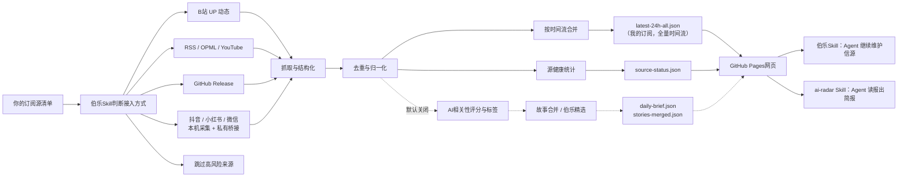

<div align="center">

# AI News Radar

## 个人订阅聚合器｜把你自己的订阅源汇成一条信息流

**B站、抖音、小红书、微信公众号、YouTube、RSS、GitHub Release —— 你订阅的人发了什么，全在一个页面上，按时间流看。**

[](https://github.com/kunkunzi996/ai-news-radar/stargazers)
[](https://kunkunzi996.github.io/ai-news-radar/)
[](https://github.com/kunkunzi996/ai-news-radar/actions/workflows/update-news.yml)
[](skills/radar/README.md)
[](LICENSE)

[在线页面](https://kunkunzi996.github.io/ai-news-radar/) · [English](README.en.md) · [雷达Skill](skills/radar/README.md) · [伯乐Skill](skills/ai-news-radar/README.md) · [信息源策略](docs/SOURCE_COVERAGE.md)

</div>

---

## 30秒选边上车

**① 只想看订阅流** → 不用装任何东西，直接打开[在线页面](https://kunkunzi996.github.io/ai-news-radar/)。

**② 想让Agent替你读** → 装雷达Skill（ai-radar），零API、零Key、零服务器：

```bash
npx skills add LearnPrompt/ai-news-radar -s ai-radar -g
```

装完对Agent说一句：`今天AI圈有什么？`


**③ 想要一个完全属于自己的雷达** → fork本仓库，让内置的[伯乐Skill](skills/ai-news-radar/README.md)帮你录入信源、部署GitHub Pages。信源你选，数据归你。

三层是一条路：看报 → 让Agent读报 → 自己办报。

---

## 这是什么

AI News Radar 是一个**自动更新的个人订阅聚合器**。

你在各个平台上关注的人——B站 UP 主、抖音博主、小红书博主、微信公众号、YouTube 频道、RSS 博客、GitHub 项目——发了新内容，它每小时自动抓一遍，去重、合并、按时间流汇总到一个静态页面上。

> **关于「AI」这个名字**：本项目最初是「24 小时 AI 更新雷达」，靠 AI 相关性打分从海量信源里精选 AI 新闻。**2026-07-11 起定位调整为个人订阅聚合器：AI 相关性不再是筛选标准**，你订阅的人发什么就显示什么，跟 AI 有没有关系都一样进来。
>
> AI 打分算法（`scripts/ai_relevance.py`）**保留但默认关闭**：阈值由环境变量 `AI_RELEVANCE_THRESHOLD` 控制（缺省 `0.65`），本部署的 GitHub Actions 变量设为 `0`，即不过滤。想恢复「AI 精选」模式，删掉这个变量即可——所有能力都还在。

不用装任何东西：打开网页看订阅流。想要一个完全属于自己的，fork 本仓库，配上你自己的信源，数据归你。Codex / Claude Code 这类 Agent 可以用项目内置的 **伯乐Skill** 帮你评估和录入新信源、维护抓取逻辑、部署 GitHub Pages。

它不是「又一个新闻网页」，而是一条轻量的 pipeline：**信源评估 → 抓取 → 去重 → 合并 → 源健康监控 → 静态页面发布**，上线后不消耗模型额度。


## 为什么做这个

你关注的人，分散在七八个 App 里。

B站有几个 UP 主，抖音关注了几个博主，微信里躺着一堆没读的公众号，YouTube 订阅了几个频道，还有几个 RSS 博客和 GitHub 项目。

想知道「我关注的人今天发了什么」，得挨个打开、挨个下拉刷新，每个 App 还都想多留你十分钟。

**这个项目把它们收成一条按时间排的流。** 你订阅了谁，就只看谁；发的是不是 AI，不重要。

它不替你决定什么值得看，也不给你推荐你没订阅的东西——**信息源是你选的，顺序是时间决定的**。

配套的 **伯乐Skill** 负责另一件事：帮你评估和录入新信源（哪些能拿到稳定 RSS、哪些需要桥接、哪些干脆别加），以及维护抓取逻辑和部署。它是给「自己办报」的人用的工具，不参与内容筛选。

## 能做什么

### 给普通读者

- 打开在线页面，在「我的订阅」里直接看最近 24 小时你关注的人发了什么
- 按平台切换：抖音 / 小红书 / 微信公众号 / B站 / 油管 / GitHub，各看各的
- 用站点、关键词、时间和来源筛选快速定位信息
- 看到每条消息的来源平台、作者和发布时间；已读的可标记进「已阅」
- 通过源健康看哪些信源在正常更新、哪些出了问题
- 如果开启 AI 筛选（`AI_RELEVANCE_THRESHOLD` 非 0），还能看到「伯乐精选」故事线、AI 标签与 AI 相关性分数——本部署默认关闭

### 给内容创作者

- 保留原始来源链接，方便继续深挖、核对事实和做选题
- 把同一个事件的多个来源聚合到一起，减少重复阅读
- 开启 AI 筛选后，还能用 AI 标签和多源重合信号判断选题的可信度与优先级（默认关闭）

### 给开发者和Agent

- 默认不需要 API Key、不需要登录态、不需要 LLM额度
- 订阅源类型：B站 UP、抖音/小红书博主、微信公众号、YouTube 频道、RSS/OPML、GitHub Release
- GitHub Actions自动生成 `data/*.json` 并发布到 GitHub Pages
- Codex / Claude Code / Hermes / OpenClaw 可以通过项目内置的伯乐Skill继续维护信源、抓取逻辑和页面
- 需要登录态的平台（抖音、小红书、微信）走本机采集 + 私有桥接仓库，cookie 和登录态**只留在本机**，不进任何公开仓库

## 定位演进：从 AI 精选雷达到订阅聚合器

这个项目最早叫「24 小时 AI 更新雷达」，做的是**替你从海量信源里精选 AI 新闻**：AI 相关性打分、故事线合并、热点聚簇、宁缺毋滥的精选门槛。

用下来发现真正每天要看的，不是「AI 圈今天发生了什么」，而是**「我关注的那些人今天发了什么」**——而后者散落在七八个 App 里，没有任何一个页面能一起看。

**2026-07 起，主线改为个人订阅聚合器**：默认层是你自己订阅源的统一时间流，AI 相关性不再是筛选标准。

原来的 AI 能力**全部保留，只是默认关闭**：

- **AI 相关性打分**（`scripts/ai_relevance.py`）：阈值由环境变量 `AI_RELEVANCE_THRESHOLD` 控制（缺省 `0.65`）。本部署的 Actions 变量设为 `0`，即不过滤。**删掉这个变量就回到「AI 精选」模式**。
- **故事线合并 / 多源证据聚合**：把同一事件的多个来源合并（`stories-merged.json`、`merge-log.json`），开着不影响订阅流。
- **伯乐精选与热点视图**：多源聚簇 × 时间衰减排序，几个独立信源同时在说的事才算热点；数据不够时自动隐藏，不留空壳。
- **评分回测工具**（`scripts/backtest_scoring.py`）：在历史归档上重放对比两个版本的评分逻辑。规矩没变——动评分必须附带 ≥14 天回测报告。
- **ai-radar 消费Skill**：装上后对 Agent 说「今天AI圈有什么」，它直接读本站公开 JSON 出中文简报，零 API、零 Key。

历次改动见 [Releases](https://github.com/LearnPrompt/ai-news-radar/releases)。

## 工作原理



实线是默认路径：抓取 → 去重 → 时间流 → 静态页面。虚线是可选的 AI 精选路径，把 `AI_RELEVANCE_THRESHOLD` 设成非 0 就会接上。

不是简单把信息堆起来——一次性甩几万条出来等于没用，所以处理拆成一条稳定 pipeline：抓取、去重、归一、源健康、生成静态站点，上线后不消耗模型额度。

公开版不要求配置 LLM API Key，不依赖 X API 和邮箱。需要登录态的平台（抖音、小红书、微信公众号）走「本机采集 → 私有桥接仓库 → Actions 只读克隆」的路子，cookie 和登录态**永远不进公开仓库**。

## 数据产物

每次更新会生成一组静态JSON文件，页面只读取这些文件，不需要后端服务。

核心文件包括：

- `data/latest-24h-all.json`：**订阅流主数据**（「我的订阅」和各平台 tab 读这个）。本部署跑 `--all-time`，内容是全量归档时间流，不是只有 24 小时
- `data/archive.json`：归档全集，保留天数由 Actions 变量 `ARCHIVE_DAYS` 控制（默认 180 天）
- `data/source-status.json`：每个订阅源的抓取状态、条目数和源健康
- `data/latest-24h.json`：经 AI 相关性筛选后的消息（`AI_RELEVANCE_THRESHOLD=0` 时等于全量）
- `data/daily-brief.json`：伯乐精选故事线，AI 精选模式下供首页 Top 3 使用
- `data/stories-merged.json` / `data/merge-log.json`：故事合并后的事件集合与合并记录，方便调试与审计

后三个属于 AI 精选路径的产物；默认（不过滤）模式下页面主要读前三个。

## 快速开始

普通用户不用安装，直接打开在线页面即可。

想fork改造新版本，可以本地运行：

```bash
git clone https://github.com/kunkunzi996/ai-news-radar.git
cd ai-news-radar
python3 -m venv .venv
source .venv/bin/activate
pip install -r requirements.txt
python scripts/update_news.py --output-dir data --window-hours 24
python scripts/local_server.py --host 127.0.0.1 --port 8080
```

打开：

```text
http://localhost:8080
```

如果采集任务已经在云端生成了同样结构的 `data/*.json`，本地页面可以只负责展示远程数据：

```text
http://127.0.0.1:8080/?dataBase=https://你的域名或GitHub Pages路径/data/
```

页面会记住这个远程数据目录，并在右上角显示 `远程数据`。要切回本机 `data/`，打开：

```text
http://127.0.0.1:8080/?dataBase=local
```

如果你有自己的 OPML：

```bash
cp feeds/follow.example.opml feeds/follow.opml
# 把自己的订阅源写进 feeds/follow.opml，不提交这个文件
python scripts/update_news.py --output-dir data --window-hours 24 --rss-opml feeds/follow.opml
```

## 给Agent看的教程

如果你想让Codex / Claude Code / OpenClaw / Hermes帮你搭自己的版本，可以直接说：

```text
请使用伯乐Skill，先问我要订阅源清单（B站/抖音/小红书/微信公众号/YouTube/RSS/GitHub），然后帮我判断每个源该用官方 RSS、公开 feed、本机采集桥接，还是跳过。目标是部署一个不需要服务器、能用 GitHub Actions 自动更新的个人订阅聚合站，把我关注的人发的内容汇成一条时间流。不要把任何 API Key、cookies、token、登录态写入仓库。
```

项目内置两个 Skill，分工是「雷达管读，伯乐管选」：

- `skills/radar/`：**ai-radar 雷达Skill**（消费侧）——不用fork就能装，自然语言问AI资讯，读本站公开JSON出简报
- `skills/ai-news-radar/`：**伯乐Skill**（维护侧）——fork后用它录入信源、维护抓取逻辑、部署 GitHub Pages

新Agent接手验收时，推荐先读：

- `README.md`
- `README.en.md`
- `docs/GPT_HANDOFF.md`
- `docs/SOURCE_COVERAGE.md`
- `docs/V2_PRODUCT_BRIEF.md`

## GitHub 自动更新

`.github/workflows/update-news.yml` 已经配置好定时任务。

- 支持手动触发 `workflow_dispatch`
- 推送到 `master` 时会立即刷新一次，纯 `data/**` 变更除外
- 默认每 30 分钟错峰运行：`7,37 * * * *`（每小时第 7、37 分，减少整点高负载导致的延迟或漏跑）
- 自动生成并提交 `data/*.json`；工作流使用 `git add data/`，避免新增 JSON 文件因为白名单遗漏而停留在旧更新时间
- 默认读取公开线上配置 `config/online-sources.json`，其中 RSS/YouTube feed 由 `feeds/online-sources.opml` 管理
- 线上信源支持五类：B站 UP、抖音/小红书博主、微信公众号、GitHub Release、RSS/YouTube feed
- 抖音、小红书、微信公众号需要登录态，走「本机定时采集 → 导出只含公开字段的 JSONL → 推送私有桥接仓库 → Actions 用只读部署密钥克隆」的链路，cookie 与登录态不进任何公开仓库
- AgentMail、X API、SocialData、TikHub、WaytoAGI 等原项目内置聚合源不再进入默认部署输出。如需恢复旧全源模式，可在本地手动运行 `python scripts/update_news.py --source-scope all_sources ...`

默认情况下，本项目不需要任何API Key就能跑核心流程。

## GitHub Pages 最小上线

当前仓库按 GitHub Pages 项目页发布，公开地址为：

```text
https://kunkunzi996.github.io/ai-news-radar/
```

第一次开启时，在 GitHub 仓库页面进入 `Settings` -> `Pages`，选择 `Deploy from a branch`，分支选 `master`，目录选 `/(root)`，保存后等待 Pages 部署完成。

上线后至少检查这三个地址：

```text
https://kunkunzi996.github.io/ai-news-radar/
https://kunkunzi996.github.io/ai-news-radar/assets/styles.css
https://kunkunzi996.github.io/ai-news-radar/data/source-status.json
```

只要首页能打开，样式正常，`data/source-status.json` 返回 JSON，并且页面右上角显示源状态，就说明 GitHub Pages 静态资源和 `data/*.json` 已经读通。

如果公开地址仍返回 404，通常表示 Pages 还没开启、还没部署完成，或还没有把本轮改动提交并推送到 `master`。

线上页面右上角显示的“更新时间”来自 `data/latest-24h.json` 的 `generated_at`。如果页面长时间停在旧时间，优先检查 GitHub Actions 最近一次 `Update AI News Snapshot` 是否运行、是否有抓取错误、以及仓库 Pages 是否部署到包含最新 `data/` 提交的分支。

如果你明确想部署到自己的服务器自动跑，推荐使用 `systemd timer` 定时刷新数据，再用 Nginx 只对外提供静态页面和 `data/*.json`。完整步骤见 [服务器部署手册](docs/guides/server-deployment.md)，不要把本地管理后台 `scripts/local_server.py` 直接暴露到公网。

主页面内置一个本地采集控制台、“订阅成员”和“高级信源配置”面板。
日常新增/删除订阅对象优先用“订阅成员”；“高级信源配置”用于编辑类型、地址、
环境变量、备注和启用状态等底层字段。
如果使用 `scripts/local_server.py` 启动本地页面，“保存高级配置”按钮会把
本机私有参数保存到项目根目录的 `sources.config.json`；订阅名单统一由
`config/online-sources.json` 管理。“刷新看板数据”按钮会按页面选择的“采集范围”
触发一次固定的本地刷新脚本，并读取统一的线上订阅名单；它不会
启动抖音/小红书采集，只会读取普通信源和已有平台采集结果。
采集范围目前只有两个白名单选项：默认“过去24小时”，以及第一次补历史时
手动使用的“全量”。过去24小时模式限制的是“本轮新采集/入库”的内容：
只接收有可信发布时间且落在窗口内的新增记录；页面输出仍保留已有全量归档，
也就是“旧数据 + 新采集的 24 小时数据”。没有发布时间的历史动态不会再靠
本轮 `first_seen_at` 混进 24 小时新采集结果。“检查状态”会读取
`/api/local-status`，把 `data/source-status.json` 里的异常翻译成维护提示，
例如 B站 cookie 缺失、MediaCrawler JSONL 路径不存在等；
同时会做本地只读探针，提示 MediaCrawler JSONL 是否缺失或超过 36 小时未更新。
维护卡片会给出白名单“修复”入口，可以打开 B站登录页或 MediaCrawler JSONL 所在文件夹。
这个本地后台只绑定 `127.0.0.1`，只允许写这一个配置文件，只运行项目内固定
刷新命令；维护入口只打开页面或文件夹，
不会保存 cookie、token、`.env`、微信登录态或浏览器 profile。

### 线上信源配置一键同步

“线上信源”是给 GitHub Actions 用的公开配置，不等同于本机私有的
`sources.config.json`。它只写这两个可提交文件：

- `config/online-sources.json`
- `feeds/online-sources.opml`

两块配置的职责很简单：**线上网页实际采集什么，以“线上信源”为准；“订阅成员”
只管理这台电脑上的本地私有采集。** 想让新订阅出现在 GitHub Pages 和云端定时采集里，
请在本机的“线上信源”面板新增后点击“同步到线上”。只改“订阅成员”不会改变线上订阅。

本地打开 `http://127.0.0.1:8080/` 后，在“信源配置”区域可以看到
“线上信源”面板。第一版只支持添加、启用/停用和删除三类公开安全源：

- B站 UP：填写 UP 主名称和 UID。
- GitHub Release：填写 `owner/repo` 或 GitHub 仓库 URL。
- RSS/YouTube：填写标题和 RSS/Atom/YouTube feed URL。

点“保存配置”只会写入本地公开配置文件；点“同步到线上”会由本地后台校验、
精确暂存、提交并推送。同步过程禁止 `git add .`，也不会暂存
`data/*.json`、`sources.config.json`、`feeds/follow.opml`、`local-secrets/`
或任何私密文件。公网 GitHub Pages 是静态页，不能直接写 GitHub；要改线上信源，
请用本机 `127.0.0.1:8080` 控制台。

### GitHub 星标安全同步（V3）

本地控制台还提供 GitHub 星标同步入口。它只读取公开星标，不需要 Preview token、
TTL、cursor 或 GitHub 登录态；绑定记录保存数字 `account_id`，托管仓库保存数字
`repo_id`。每次同步都先 Preview，再由用户勾选确认后 Apply。

- 只支持单个 GitHub 账号，最多处理 50 个公开星标；出现第 51 个公开星标时整次中止。
- 非公开仓库只计入跳过数量，不展示名称、URL 或 id。
- Release 优先；没有 Release 时才读取公开 commit，并按稳定仓库身份每天 UTC 最多保留一个最新 commit 快照。
- 取消星标只会自动停用托管源，不删除源、不触发 pending-purge，历史按 `archive_days` 自然老化。
- 页面会明确显示 `无变化`、`已推送`、`已保存，待提交`、`已提交，待推送`，以及 partial/deferred、stale 和 Recovery 状态。
- Apply 只允许经过 manifest、operation trailer、稳定 patch-id 和文件哈希核对的精确操作提交；不会使用裸 `git push` 或全仓库恢复。

V3 代码已完成自动化和 mock 浏览器验收，当前仍待用户授权真实账号的首次 Preview/Apply；
在真实配置推送前，不应把它描述为已上线。

推荐流程：

1. 启动本地小后台：

   ```powershell
   .\.venv\Scripts\python.exe scripts/local_server.py --host 127.0.0.1 --port 8080
   ```

2. 打开 `http://127.0.0.1:8080/`。要修改 GitHub Pages 的云端订阅，用“线上信源”；
   只在本机采集的私有订阅，用“订阅成员”。需要改本地类型、地址、环境变量、备注或
   启用状态时，再展开“高级信源配置”。
3. 在“高级信源配置”里点“保存高级配置”，生成或覆盖根目录 `sources.config.json`
   （该文件已加入 `.gitignore`，默认不提交）。按钮会显示“保存中... / 已保存 / 保存失败”。
4. 点“检查状态”查看哪些渠道需要维护；维护提示里的“打开后台/扫码”“打开B站登录”“打开JSONL文件夹”等按钮会直达维护入口，“定位信源”会跳回对应配置项。
5. 用信源列表上方的筛选按钮按“启用 / 需维护 / 小红书 / 抖音 / B站 / RSS / GitHub”查看订阅。
6. 选择“采集范围”，再点“刷新看板数据”即可写入配置并刷新 `data/*.json`，
   完成后页面会自动重载。日常默认选“过去24小时”：本轮只接收 24 小时内
   新内容，但页面继续展示已有归档。第一次接入或需要重建历史时再选“全量”。
   同一个范围也会传给抖音/小红书的“启动采集”维护按钮：默认 24 小时会让
   MediaCrawler 启动后统计当天 `creator_contents_*.jsonl` 里有多少作品发布时间在
   24 小时内，并保留原始 JSONL 不覆盖；YouTube 等 RSS 类来源则在刷新脚本入库时按
   `--collect-window-hours 24` 过滤。
   注意：MediaCrawler 当前 creator 模式没有平台端“只请求 24 小时”的参数；24h
   模式会把默认抓取量限制到每个博主最近 5 条左右，再按发布时间过滤，避免日常增量采集
   重新扫太多历史。
   如果想在命令行里手动刷新，也可以显式运行：

   ```powershell
   .\.venv\Scripts\python.exe scripts/update_news.py --source-config sources.config.json --output-dir data --window-hours 24 --archive-days 3650 --collect-window-hours 24 --all-time
   # 需要补全历史时去掉 --collect-window-hours 24，保留 --all-time
   .\.venv\Scripts\python.exe scripts/update_news.py --source-config sources.config.json --output-dir data --window-hours 24 --archive-days 3650 --all-time
   ```

7. 检查 `data/source-status.json`，其中 `source_config.active=true` 表示配置文件已生效。

如果仍用 `python -m http.server 8080`，页面没有写文件接口，“写入”会失败；
“检查状态”和“刷新看板数据”也无法连接本地后台；此时可以继续使用“导出/复制”
作为兜底。

没有 `sources.config.json` 时，刷新脚本仍沿用原来的默认范围
`tested_creator_sources`。

高级源配置模板见 `examples/advanced-sources.env.example`，

预算说明见 `docs/research/advanced-source-free-tier-budget-2026-05-10.md`，

旧版全源模式仍保留 TikHub 抓取能力；本地测试 TikHub 抓取时可以先小流量强制跑一次：

```bash
export TIKHUB_ENABLED=1
export TIKHUB_API_KEY='你的 TikHub API Key'
export TIKHUB_FORCE_RUN=1
export TIKHUB_QUERY='OpenAI,Claude,大模型,Agent,AI工具,人工智能,AI'
export TIKHUB_PLATFORMS=douyin,xiaohongshu
export TIKHUB_MAX_RESULTS=10
export TIKHUB_DAILY_ITEM_LIMIT=10
python3 scripts/probe_tikhub.py --query 'OpenAI,Claude,大模型,Agent,AI工具,人工智能,AI' --platforms douyin,xiaohongshu --max-results 10
python3 scripts/update_news.py --output-dir /tmp/ai-news-radar-tikhub --window-hours 24 --archive-days 3
python3 - <<'PY'
import json
from collections import Counter

status = json.load(open("/tmp/ai-news-radar-tikhub/source-status.json"))
latest = json.load(open("/tmp/ai-news-radar-tikhub/latest-24h-all.json"))
print("failed_sites =", status.get("failed_sites"))
print("empty_advanced_sources =", status.get("empty_advanced_sources"))
print("tikhub_status =", [s for s in status.get("sites", []) if str(s.get("site_id", "")).startswith("tikhub")])
counts = Counter(i.get("site_id") for i in latest.get("items_all_raw", []))
print("tikhub_24h_counts =", {k: counts[k] for k in sorted(counts) if str(k).startswith("tikhub")})
PY
```

如果临时恢复旧版全源模式并需要远端重跑 TikHub，可自行调整 workflow 后再触发：

```bash
gh workflow run update-news.yml --ref master -f force_tikhub=true
```

自媒体栏目使用独立的 7 天热榜池，不改变其他栏目的 24 小时窗口。抖音和
小红书搜索都优先请求“一周内最多点赞”，再从响应中提取点赞、收藏、评论
和分享数。榜单分数由 85% 互动热度和 15% 的 24 小时新鲜度加分组成；因此
真正的周内爆款优先，但刚开始起量的新内容仍有机会进入 Top 3。

B站动态源默认追踪 `Koji杨远骋at十字路口` 和 `技术爬爬虾` 两个账号，并使用
公开 opus 接口。可以用 `BILIBILI_DYNAMIC_UIDS` 和
`BILIBILI_DYNAMIC_SOURCE_NAMES` 覆盖账号列表；旧的 `BILIBILI_DYNAMIC_UID` /
`BILIBILI_DYNAMIC_SOURCE_NAME` 仍可用于单账号兼容。需要验证登录态完整动态时，
可以只在本地或 GitHub Secrets 里提供 cookie，不要提交到仓库。`BILIBILI_COOKIE`
支持普通请求头格式，也支持 Cookie-Editor 等插件导出的 Netscape `cookies.txt`
或 JSON 文本；本地文件可以用 `BILIBILI_COOKIE_FILE` 指向：

```powershell
$env:BILIBILI_DYNAMIC_ENABLED='1'
$env:BILIBILI_DYNAMIC_UIDS='505301413,316183842'
$env:BILIBILI_DYNAMIC_SOURCE_NAMES='Koji杨远骋at十字路口,技术爬爬虾'
$env:BILIBILI_COOKIE_FILE='C:\path\to\cookies.txt'
.\.venv\Scripts\python.exe scripts/update_news.py --output-dir data --window-hours 24
```

成功走登录态时，`data/source-status.json` 中 `bilibili_dynamic.fetch_mode` 会是
`cookie_full_dynamic`；多账号混合结果会在 `bilibili_dynamic.accounts` 里逐个记录。
如果某个账号的 cookie 完整动态失败，会单账号回退到 `public_opus_fallback`。
本地控制台的 B站维护卡片支持小号专用流程：点“打开B站小号登录”会启动
`local-secrets/bilibili-profile` 这个独立 Chrome/Edge profile，不会复用你的日常
浏览器主号。登录小号后点“同步cookie”，本地服务会通过本机 CDP 读取这个专用
profile 的 B站 cookie，并写入 `local-secrets/bilibili-cookies.txt`；再点“刷新看板数据”
即可自动作为 `BILIBILI_COOKIE_FILE` 使用。`local-secrets/` 已加入 `.gitignore`，
不要把 cookie 内容复制进聊天或提交到仓库。
需要往更早日期翻页时，可以调大 `BILIBILI_DYNAMIC_MAX_ITEMS` 和
`BILIBILI_DYNAMIC_MAX_PAGES`，例如每个账号最多抓 80 条、最多翻 8 页：

```powershell
$env:BILIBILI_DYNAMIC_ENABLED='1'
$env:BILIBILI_COOKIE_FILE='C:\path\to\cookies.txt'
$env:BILIBILI_DYNAMIC_UIDS='505301413,316183842'
$env:BILIBILI_DYNAMIC_SOURCE_NAMES='Koji杨远骋at十字路口,技术爬爬虾'
$env:BILIBILI_DYNAMIC_MAX_ITEMS='80'
$env:BILIBILI_DYNAMIC_MAX_PAGES='8'
.\.venv\Scripts\python.exe scripts/update_news.py --output-dir data --window-hours 1440 --archive-days 120
```

只想在本地页面查看这两个 B站账号、并取消 24 小时窗口时，可以生成
B站-only 全时间视图：

```powershell
$env:BILIBILI_DYNAMIC_ENABLED='1'
$env:BILIBILI_COOKIE_FILE='C:\path\to\cookies.txt'
$env:BILIBILI_DYNAMIC_UIDS='505301413,316183842'
$env:BILIBILI_DYNAMIC_SOURCE_NAMES='Koji杨远骋at十字路口,技术爬爬虾'
$env:BILIBILI_DYNAMIC_MAX_ITEMS='200'
$env:BILIBILI_DYNAMIC_MAX_PAGES='20'
.\.venv\Scripts\python.exe scripts/update_news.py --output-dir data --archive-days 3650 --bilibili-only --all-time
```

抖音指定博主可以通过本地 MediaCrawler 导出的 JSONL 接入。这个桥接默认关闭；
常规刷新只读独立 MediaCrawler 目录导出的 `creator_contents_*.jsonl`，不会从
主项目读取 cookie、浏览器 profile 或登录态：

```powershell
$env:MEDIACRAWLER_DOUYIN_ENABLED='1'
$env:MEDIACRAWLER_DOUYIN_JSONL='E:\AI-news-reader\MediaCrawler-local-test\output\douyin\jsonl\creator_contents_2026-07-01.jsonl'
$env:MEDIACRAWLER_DOUYIN_SOURCE_NAME='Simon林'
.\.venv\Scripts\python.exe scripts/update_news.py --output-dir data --window-hours 24 --archive-days 3650 --all-time
```

成功时，`data/source-status.json` 中 `mediacrawler_douyin.item_count` 会显示读到的
作品数；切到页面的“全部 / 自媒体”更适合查看完整博主作品列表。不要提交
MediaCrawler 的 `chrome-profile`、cookie 或登录态文件。
本地控制台的“检查状态”只会检查配置里的 JSONL 文件是否存在、是否为空、
是否超过 36 小时未更新；如果同目录里已经有更新的
`creator_contents_*.jsonl`，刷新脚本会自动读取最新文件，不需要每次手动改日期。
抖音维护卡片里的“启动抖音采集”只会调用本机固定目录
`E:\AI-news-reader\MediaCrawler-local-test` 的 MediaCrawler creator 模式，并通过
采集专用 Chrome profile `MediaCrawler-local-test\chrome-profile` 打开抖音；它不应
复用你的日常浏览器窗口。扫码或登录状态只留在这个采集 profile 里，不会保存进
AI News Radar 仓库，也不会执行前端传入的任意命令。
当页面“采集范围”是默认“过去24小时”时，这个按钮会给 runner 传入
`--collect-window-hours 24`，并在 MediaCrawler 跑完后写出
`mediacrawler-douyin-collection-window.json` 统计文件，用来显示 24 小时命中数；
原始 `creator_contents_*.jsonl` 会保留不覆盖。默认 24h 只抓每个博主最近 5 条左右，选择
“全量”时不会生成这个 24h 统计。
启动后，本地采集面板会显示“抖音采集任务”状态卡：采集中时会自动刷新，显示
已经写入多少条、最近写入时间和当前动作；日志出现完成信号后会显示“可关闭窗口”，
再提示回到主页面点“刷新看板数据”。

小红书指定博主也可以通过本地 MediaCrawler 导出的 JSONL 接入，同样默认关闭、
常规刷新只读本地文件，不会从本项目读取 Chrome profile 或登录态：

```powershell
$env:MEDIACRAWLER_XHS_ENABLED='1'
$env:MEDIACRAWLER_XHS_JSONL='E:\AI-news-reader\MediaCrawler-local-test\output\xhs\jsonl\creator_contents_2026-07-01.jsonl'
$env:MEDIACRAWLER_XHS_SOURCE_NAME='陈抱一'
.\.venv\Scripts\python.exe scripts/update_news.py --output-dir data --window-hours 24 --archive-days 3650 --all-time
```

成功时，`data/source-status.json` 中 `mediacrawler_xhs.item_count` 会显示读到的
笔记数；主页面“自媒体”栏目会把它显示为“小红书博主”。兼容长变量名
`MEDIACRAWLER_XIAOHONGSHU_*`，但推荐用上面的 `MEDIACRAWLER_XHS_*`。
本地控制台的“启动小红书采集”会调用同一个采集专用 Chrome profile，并从现有
小红书 JSONL 的 `user_id` 自动推断干净的博主主页地址；如果没有历史 JSONL，
可用 `MEDIACRAWLER_XHS_CREATOR_ID` 指定小红书博主主页 URL。启动后页面会显示
“小红书采集任务”状态卡，采集中自动刷新，完成后会提示可以关闭采集窗口。
默认 24 小时范围同样会在采集完成后写出 24h 命中统计，状态卡会显示
“24h作品”和“原始写入”两个数字；需要补历史时先把页面采集范围切到“全量”。

GitHub 版本订阅默认追踪 `AlkaidLab/foundation-sunshine` 最近 5 次公开 release，
不再追踪普通 commit。它不需要 token，也不会调用 GitHub 登录态。刷新后它会进入
主页面“我的订阅”栏目，并在 `data/source-status.json` 里显示为
`github_foundation_sunshine_releases`。

微信公众号通过 WeRSS 桥接接入：本机 sidecar 定时采集 → 导出只含公开字段的 JSONL
（标题/链接/时间/账号/摘要，**不含 cookie 或授权态**）→ 推送私有桥接仓库 → GitHub Actions
用只读部署密钥克隆，以 `WE_MP_RSS_JSONL_DIR` 读取。这条通道的源类型是 `we_mp_rss_jsonl`；
早期的实时 `we_mp_rss` 通道仍并存，但不作为默认部署路径。微信 cookie 和登录态只留在本机
sidecar 的 `data/` 目录，绝不进入任何仓库或日志。

小红书按“先搜索、后详情”处理。搜索阶段使用 App V2 的最多点赞排序和
7 天筛选，并再次在本地校验发布时间：可信 API 时间优先；`0`、未来时间
或缺失时间会回退到 note id 的时间前缀；仍无法确认或早于 7 天的笔记会被
跳过。通过时间门禁后，如需补齐图文详情，可按需调用官方详情接口：

```python
import os
import requests

headers = {"Authorization": f"Bearer {os.environ['TIKHUB_API_KEY']}"}

search = requests.get(
    "https://api.tikhub.io/api/v1/xiaohongshu/app_v2/search_notes",
    headers=headers,
    params={
        "keyword": "AI",
        "page": 1,
        "sort_type": "popularity_descending",
        "note_type": "不限",
        "time_filter": "一周内",
    },
    timeout=30,
)
search.raise_for_status()

# Only request details after the search result passes the local 7-day time gate.
detail = requests.get(
    "https://api.tikhub.io/api/v1/xiaohongshu/app_v2/get_image_note_detail",
    headers=headers,
    params={"note_id": "通过时间校验的 note_id"},
    timeout=30,
)
detail.raise_for_status()
print(detail.json())
```

视频笔记使用 `get_video_note_detail`。详情接口用于补充作者、互动量、图片、
标签等结构化字段，不替代搜索阶段的发布时间判断。

X API演示配置见 `docs/guides/x-api-demo-config.md`；

单账号/单newsletter演示见 `docs/guides/rileybrown-alphasignal-demo.md`。

## License

[MIT](LICENSE)
